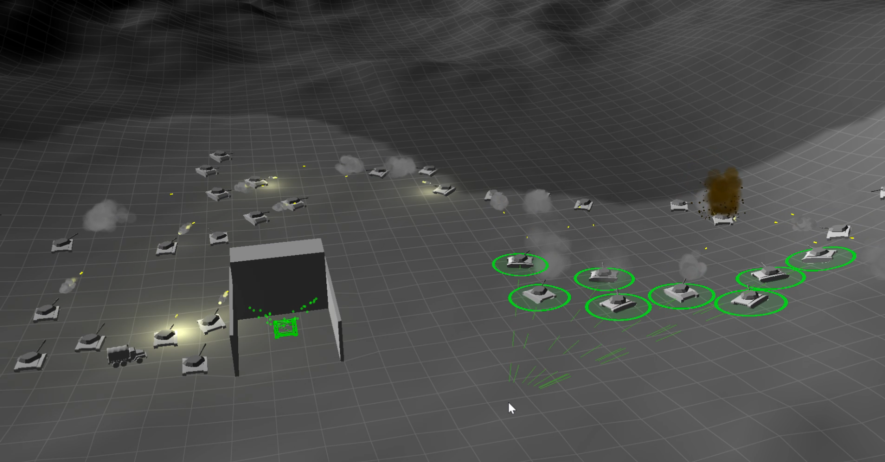
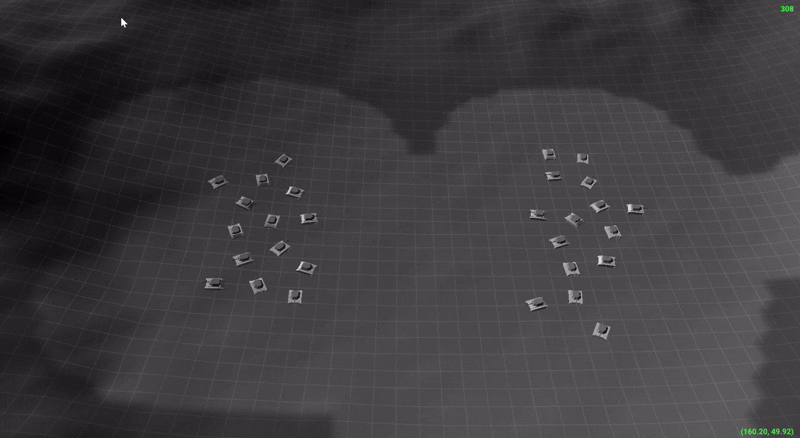

# Rts engine

## Overview
An RTS engine made in C++ and OpenGL.

## Features
* **Multithreaded pathfinding**: A* algorithm combined with boid-based collision avoidance and smooth path following.
* **Text Rendering**: Signed-distance field (SDF) font rendering.
* **Predictive Ballistics**: Calculates interception trajectories for moving targets.
* **User Interface**:
    - Box selection with Separating Axis Theorem (SAT) collision detection.
    - Selection markers and visual feedback.
    - Sweep targeting, command queuing, and visualization.
- **Vehicle Planning**: Basic vehicle movement planning and collision resolution (in progress).
- **Visual Effects**: Particle systems and dynamic lighting.
- **Asset Management**: Resource loading and handling.
- **Input System**: Robust input handling.
- **In-Game Console**: Command-line interface for debugging and settings.

## Media
Boid-based movement

Predictive ballistics

Pathfinding

